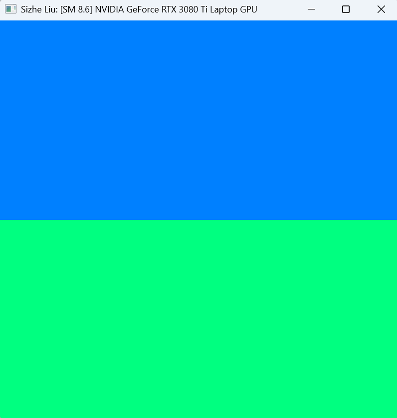
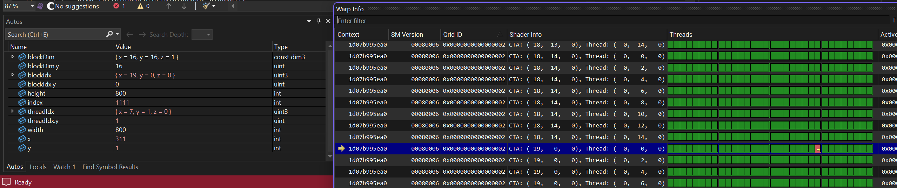
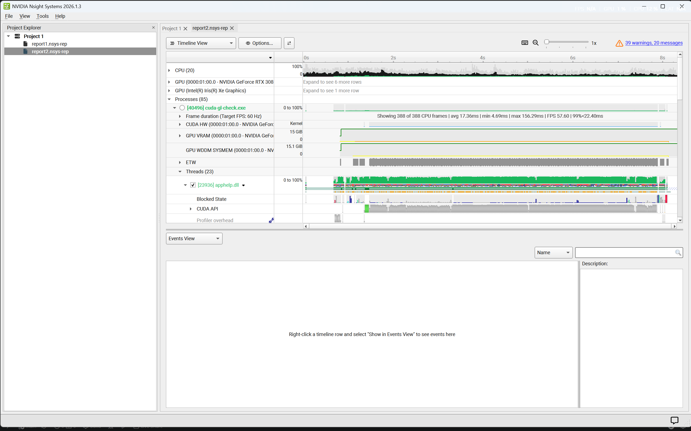
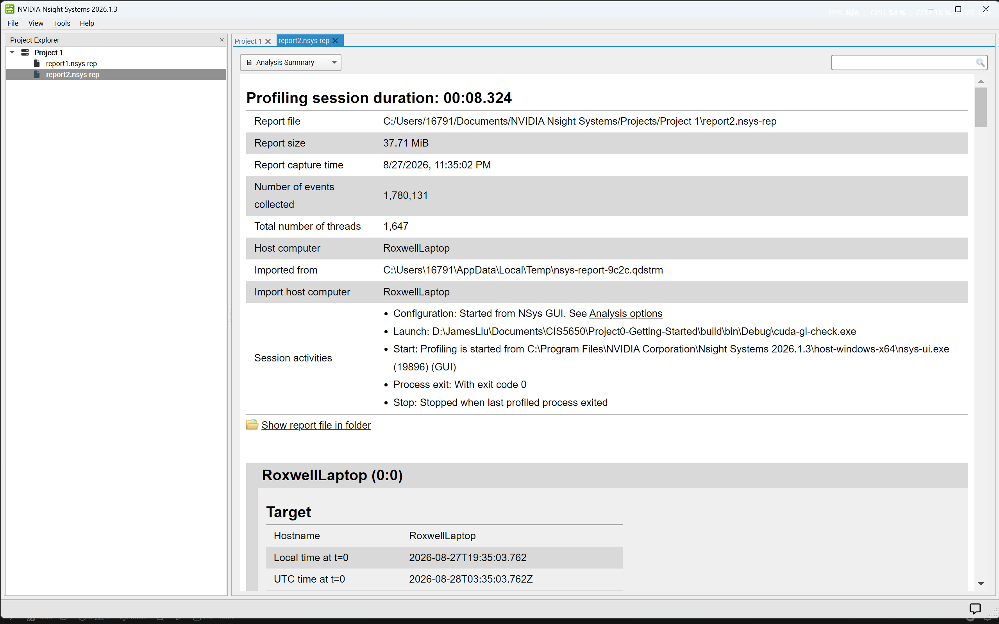
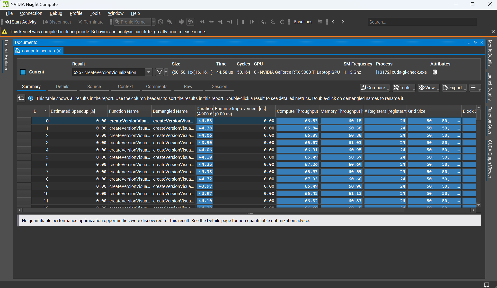
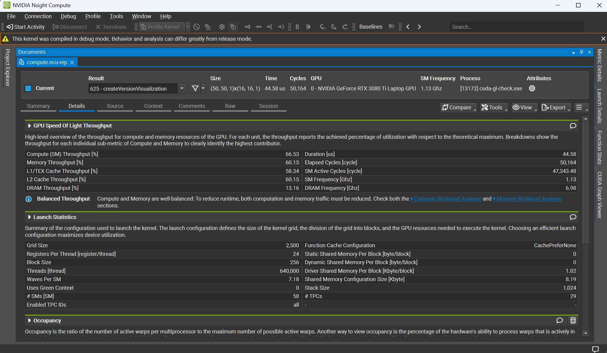
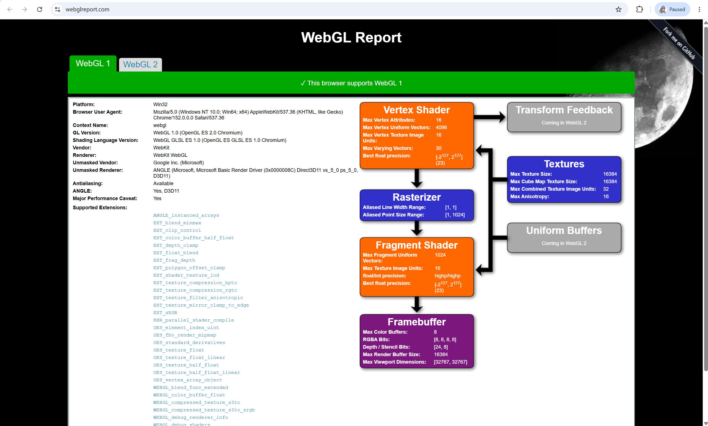
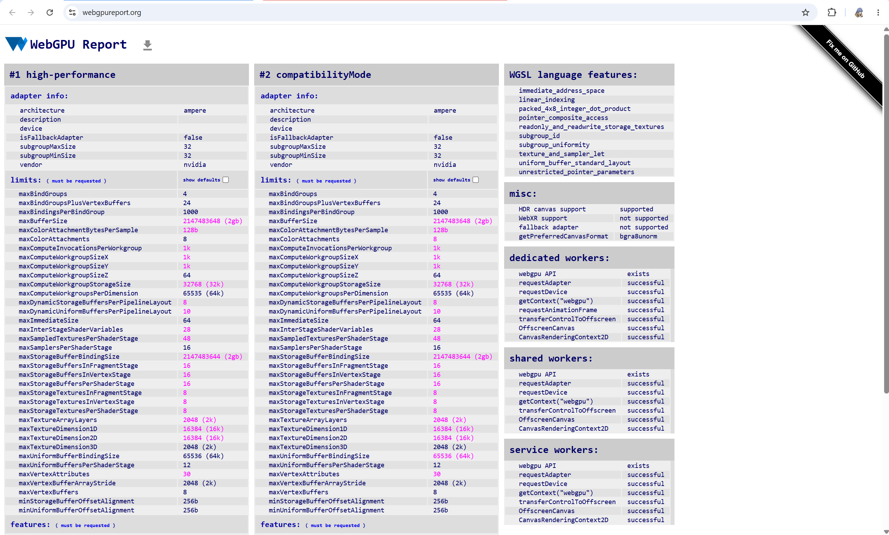

Project 0 Getting Started
====================

**University of Pennsylvania, CIS 5650: GPU Programming and Architecture, Project 0**

* Sizhe Liu
  * [LinkedIn](https://www.linkedin.com/in/sizhe-liu-2726492b6/), [personal website](https://github.com/JamesLiu12).
* Tested on: Windows 11 Pro, i9-12900H @ 2.50GHz 32GB, RTX 3080 Ti Laptop GPU 16GB (Personal Computer)

